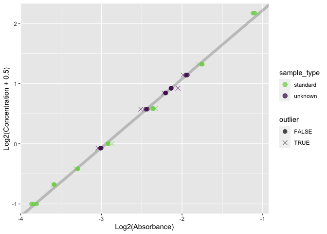

<!-- README.md is generated from README.Rmd. Please edit that file -->

# qp <a href="https://kaiaragaki.github.io/qp/"></a>

<!-- badges: start -->
<!-- badges: end -->

`qp` serves as a robust toolkit for working with MicroBCA assays.
Currently, the protocol it’s best served for is
[here](https://kai.quarto.pub/bok/western-blot.html#protein-quantification).

## Installation

You can install the development version of qp from
[GitHub](https://github.com/) with:

``` r
# install.packages("devtools")
devtools::install_github("KaiAragaki/qp")
```

## Quickstart

If you have a nicely formatted plate with no surprises (that is, it
follows
[this](https://kai.quarto.pub/bok/western-blot.html#protein-quantification)
protocol), you should really only need to plug it in to `qp` and let it
rip:

``` r
library(qp)
f <- system.file("extdata", "absorbances.txt", package = "qp")

# Most of these arguments are defaults
# I'm only writing them out so you can see what options you can set
out <- qp(
  f,
  replicate_orientation = "h",
  sample_names = c("here", "are", "my", "sample", "names"),
  remove_empty = TRUE,
  ignore_outliers = "all",
  standard_scale = c(0, 2^((2:7) - 5)),
  n_replicates = 3,
  wavelength = 562
)
#> Please wait. This will take ~10 seconds.
```

From this, you can do things like add dilution calculations:

``` r

summary <- qp_summarize(out)

qp_dilute(summary, target_vol = 15, remove_standards = TRUE)
#> `target_conc` is missing, using lowest sample concentration
#> # A tibble: 5 × 5
#>   .sample_name sample_type .mean_pred_conc sample_to_add add_to
#>   <chr>        <fct>                 <dbl>         <dbl>  <dbl>
#> 1 here         unknown               1.71           3.97  11.0 
#> 2 are          unknown               1.39           4.85  10.1 
#> 3 my           unknown               0.989          6.85   8.15
#> 4 sample       unknown               1.30           5.23   9.77
#> 5 names        unknown               0.451         15      0
```

Or make plots to assess quality:

``` r
qp_plot_standards(out)
```


